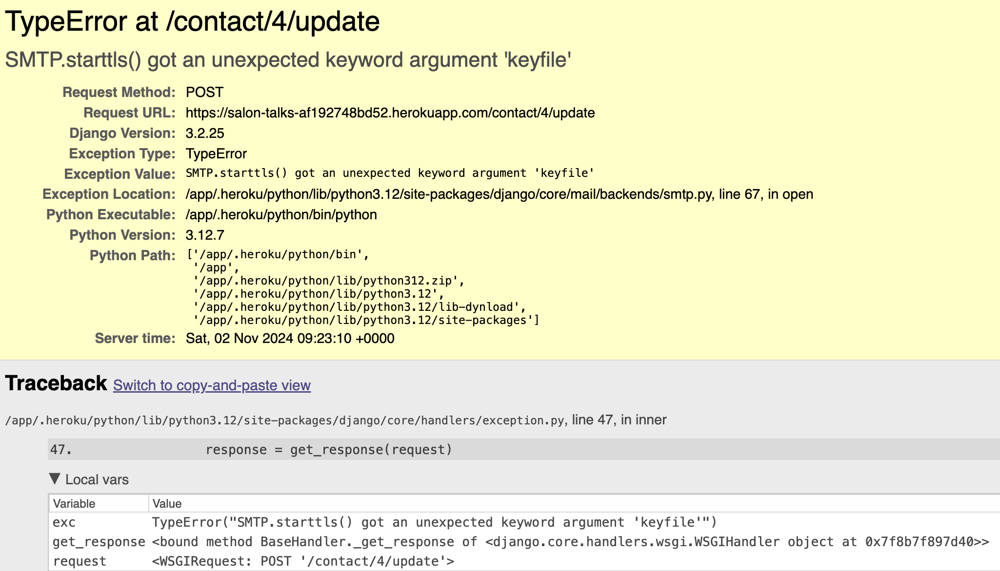

# Bugs

## Fixed Bugs

### Email replies not working

To fix this issue, I updated the Django version to 4.2. The error was occurring because Python 3.12 removed the keyfile and certfile parameters from the SMTP.starttls() method, but my current Django version (3.2.25) is still using these parameters.

