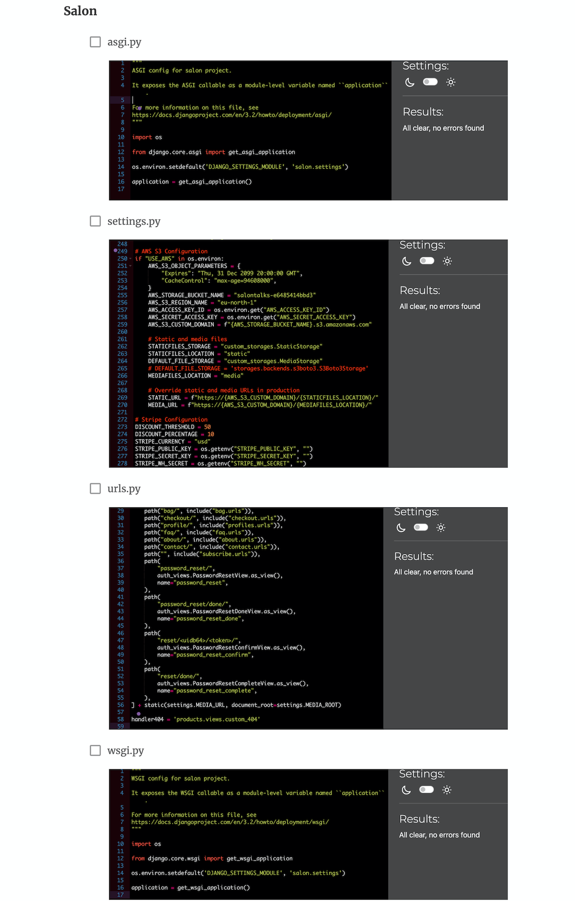

# Manual Testing

<strong>Fixes and improvements during validation</strong>

## Features
- Wrapped the `<li>` elements under the parent `<ul>` tag where necessary to ensure proper HTML structure.
- Used `<style>` tag to remove the list bullets.
- Adjusted heading levels for better hierarchy.
- Added hidden visual links in forms for accessibility.
- Made the scroll-to-top link crawlable by adding a valid `href` attribute and included a `title` attribute for better accessibility and context.

## Accessibility Improvements
- Ensured that all links are crawlable by search engines.
- Added descriptive titles to enhance user experience.

## Rich Results Testing

## Performance: Validated using [Lighthouse](https://developers.google.com/web/tools/lighthouse/)

https://docs.google.com/document/d/1M42v5yGdEz0chHrz0ZMtJ_-Rxlaq8vBqwUg6bKgzbX8/edit?tab=t.0

## HTML: Validated using the [W3C HTML Validator](https://validator.w3.org/)

### Home

### About

### Bag

### Checkout

### Checkout Success

### Contact

### FAQ

### Event list view

### Event detail view

### Subscribe

### Register Account

### Login

### Logout

### Forgot Password

### Create new password

### My Account

## CSS: Validated using the [Jigsaw W3 Validator](https://jigsaw.w3.org/css-validator/)

### Base

http://jigsaw.w3.org/css-validator/validator$link

### Checkout

http://jigsaw.w3.org/css-validator/validator$link

### FAQ

http://jigsaw.w3.org/css-validator/validator$link

### FAQ

http://jigsaw.w3.org/css-validator/validator$link

## JavaScript: Validated using [JS Hint](https://jshint.com)

### Stripe

### Cookies

## Python: Validated using the [CI Python Linter](https://pep8ci.herokuapp.com/)

### About

### Bag

### Checkout

### Common

### Contact

### FAQ

### Home

### Products

### Salon

### Subscribe

