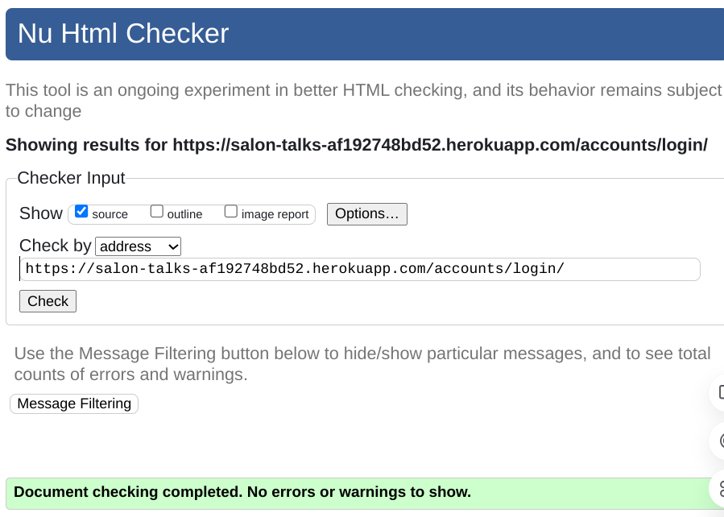

# Manual Testing

<strong>Fixes and improvements during validation</strong>

## Features
- Wrapped the `<li>` elements under the parent `<ul>` tag where necessary to ensure proper HTML structure.
- Used `<style>` tag to remove the list bullets.
- Adjusted heading levels for better hierarchy.
- Added hidden visual links in forms for accessibility.
- Made the scroll-to-top link crawlable by adding a valid `href` attribute and included a `title` attribute for better accessibility and context.

## Accessibility Improvements
- Ensured that all links are crawlable by search engines.
- Added descriptive titles to enhance user experience.

## Rich Results Testing

## Performance
**Validated using [Lighthouse](https://developers.google.com/web/tools/lighthouse/)**

### Home

### About

### Bag

### Contact

### FAQ

### Event list view

### Event detail view

### Subscribe

### Login

---

## HTML
**Validated using the [W3C HTML Validator](https://validator.w3.org/)**

### Home

### About

### Bag

### Checkout

### Checkout Success

### Contact

### FAQ

### Event list view

### Event detail view

### Subscribe

### Register Account

### Login

### Logout

### Forgot Password

### Confirm email

### Create new password

### My Account

---

## CSS
**Validated using the [Jigsaw W3 Validator](https://jigsaw.w3.org/css-validator/)**

### Base

http://jigsaw.w3.org/css-validator/validator$link

### Checkout

http://jigsaw.w3.org/css-validator/validator$link

### FAQ

http://jigsaw.w3.org/css-validator/validator$link

### FAQ

http://jigsaw.w3.org/css-validator/validator$link

---

## JavaScript
**Validated using [JS Hint](https://jshint.com)**

### Stripe

### Cookies

## Python
**Validated using the [CI Python Linter](https://pep8ci.herokuapp.com/)**

### About

### Bag

### Checkout

### Common

### Contact

### FAQ

### Home

### Products

### Salon

### Subscribe

---

## Remaining issues

### Register Account

### Forgot Password

---

## Fixed Bugs

### Email replies not working

To fix this issue, I updated the Django version to 4.2. The error was occurring because Python 3.12 removed the keyfile and certfile parameters from the SMTP.starttls() method, but my current Django version (3.2.25) is still using these parameters.

### Bag being emptied
When I put items in the bag, they are being lost on the way to secure checkout.

#### Problem

Heroku shows corrupted data:
2024-10-25T10:14:16.306229+00:00 app[web.1]: Session data corrupted
2024-10-25T10:14:16.306262+00:00 app[web.1]: Current bag state before adding: {}
2024-10-25T10:14:16.306263+00:00 app[web.1]: Adding quantity: 1 for item_id: 3
2024-10-25T10:14:16.306281+00:00 app[web.1]: Updated bag state: {'3': 1}
2024-10-25T10:14:16.392183+00:00 app[web.1]: 10.1.8.232 - - [25/Oct/2024:10:14:16 +0000] "POST /bag/add/3/ HTTP/1.1" 302 0 "https://salon-talks-af192748bd52.herokuapp.com/products/3/" "Mozilla/5.0 (Macintosh; Intel Mac OS X 10_15_7) AppleWebKit/537.36 (KHTML, like Gecko) Chrome/129.0.0.0 Safari/537.36"
2024-10-25T10:14:16.392649+00:00 heroku[router]: at=info method=POST path="/bag/add/3/" host=salon-talks-af192748bd52.herokuapp.com request_id=9992286c-105c-441d-a098-5a42a3eac931 fwd="94.234.117.51" dyno=web.1 connect=0ms service=363ms status=302 bytes=423 protocol=https
2024-10-25T10:14:16.763505+00:00 app[web.1]: Session data corrupted
2024-10-25T10:14:16.763533+00:00 app[web.1]: Total: 0, Discount: 0, Grand Total: 0
2024-10-25T10:14:16.795029+00:00 app[web.1]: 10.1.8.232 - - [25/Oct/2024:10:14:16 +0000] "GET /products/3/ HTTP/1.1" 200 17926 "https://salon-talks-af192748bd52.herokuapp.com/products/3/" "Mozilla/5.0 (Macintosh; Intel Mac OS X 10_15_7) AppleWebKit/537.36 (KHTML, like Gecko) Chrome/129.0.0.0 Safari/537.36"
2024-10-25T10:14:16.795479+00:00 heroku[router]: at=info method=GET path="/products/3/" host=salon-talks-af192748bd52.herokuapp.com request_id=6d7bc072-5405-402d-ab52-030405b9db9c fwd="94.234.117.51" dyno=web.1 connect=0ms service=266ms status=200 bytes=18349 protocol=https

#### Solution
To fix the issue I replaced the: SECRET_KEY = os.environ.get("DJANGO_SECRET_KEY", get_random_secret_key()) with: SECRET_KEY = os.environ.get('SECRET_KEY', '')

[Back to readme](../README.md)

